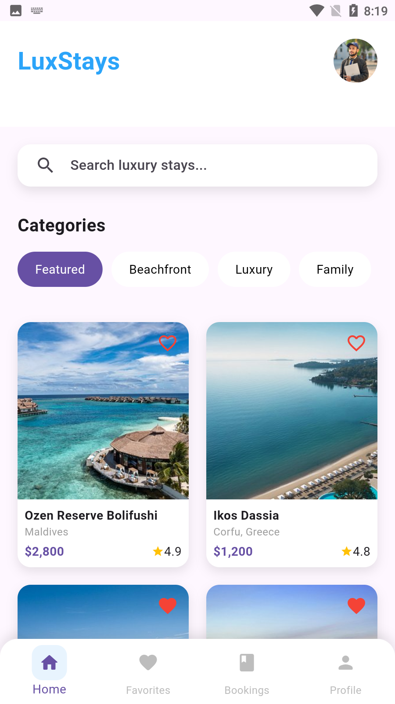
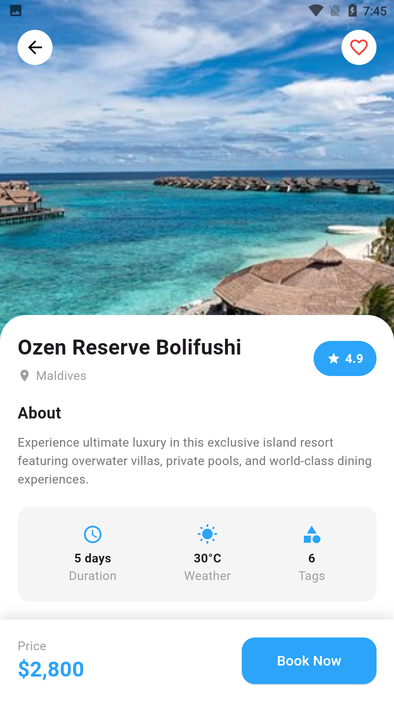
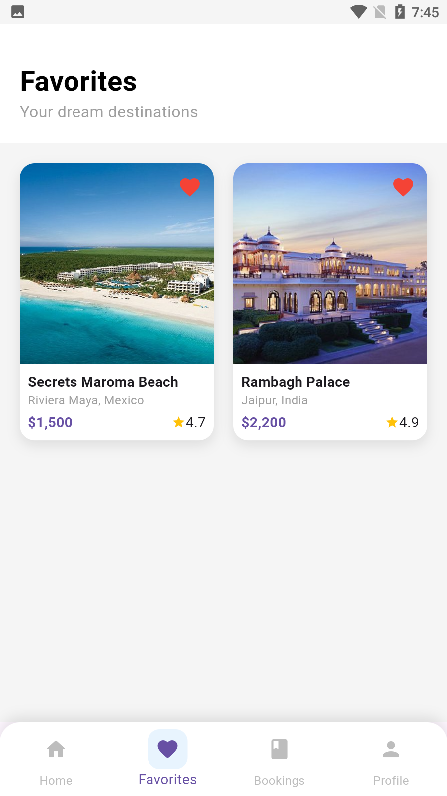
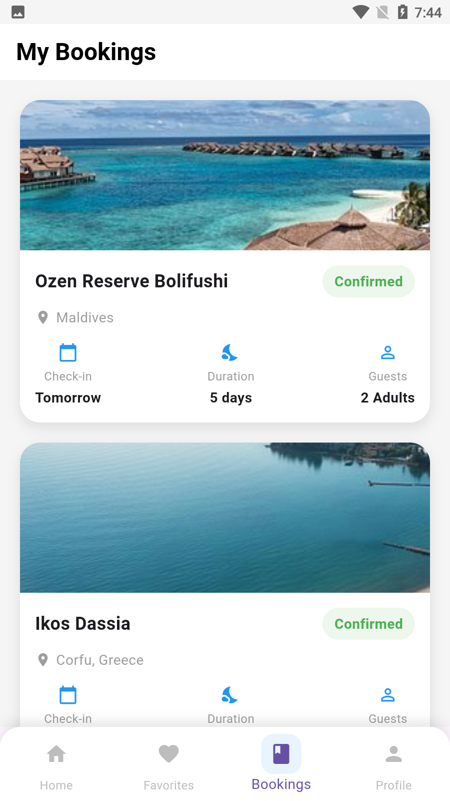
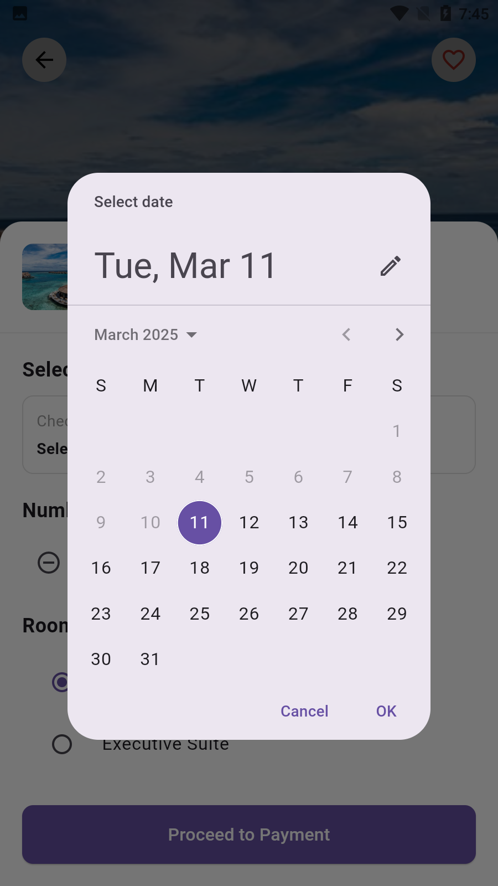
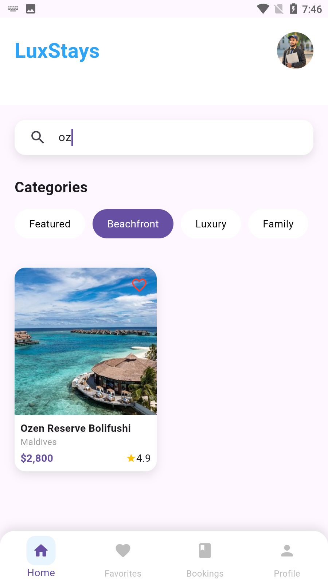
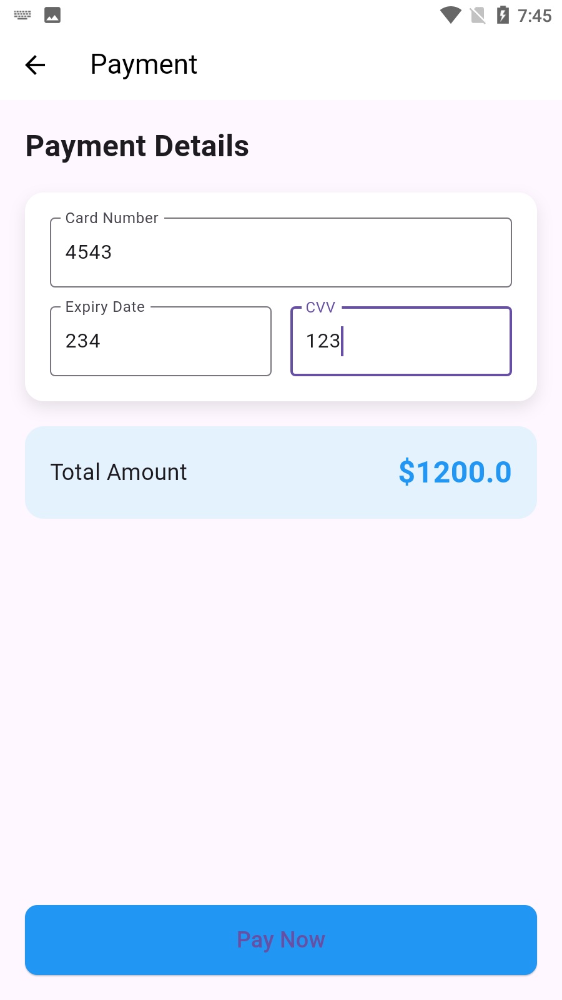
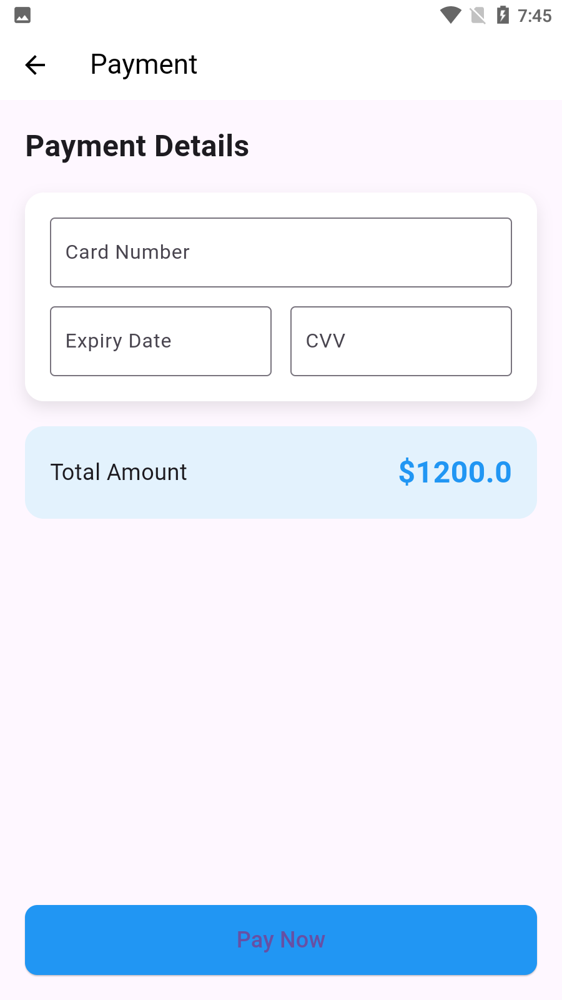
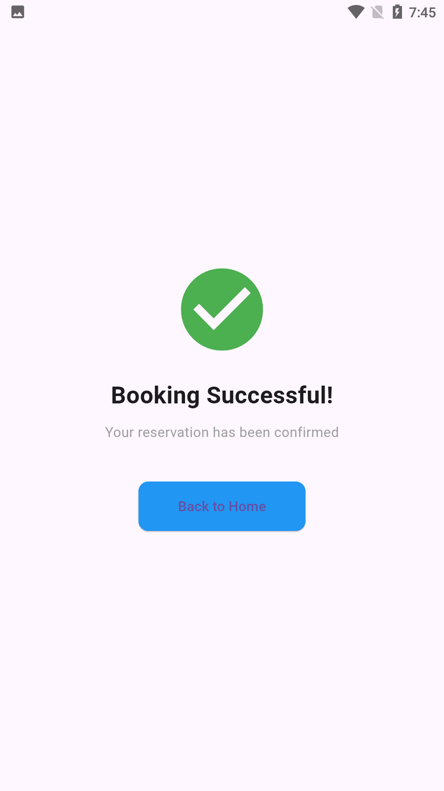

<div align="center">
  <h1>
    <br/>
    LuxStays - Luxury Hotel Booking App
  </h1>
  <h3>A Premium Hotel Booking Application with Elegant UI</h3>
</div>

<p align="center">
    <a href="https://github.com/jamalihassan0307/" target="_blank">
        
    </a>
    <a href="https://www.linkedin.com/in/jamalihassan0307/" target="_blank">
        
    </a>
</p>

## 📌 Overview

A luxuriously designed Flutter application for hotel bookings with an elegant and intuitive UI. The app features smooth animations, seamless navigation, and a comprehensive booking experience for luxury stays worldwide.

## 🚀 Tech Stack

- **Flutter** (UI Framework)
- **Provider** (State Management)
- **Custom Animations**
- **Material Design 3**

## 🔑 Key Features

- ✅ **Category Filtering**: Browse hotels by type (Luxury, Beachfront, etc.)
- ✅ **Favorites System**: Save and manage favorite properties
- ✅ **Smart Search**: Find hotels by location or amenities
- ✅ **Booking Management**: Track and manage reservations
- ✅ **Detailed Hotel Views**: Comprehensive property information
- ✅ **Secure Payments**: Integrated payment system
- ✅ **User Profiles**: Personalized user experience
- ✅ **Modern UI**: Elegant and responsive interface

## 📸 Banner


## 📸 Screenshots

### Main Features

<table border="1">
  <tr>
    <td align="center">
      
      <p><b>Home Screen</b></p>
    </td>
    <td align="center">
      
      <p><b>Hotel Details</b></p>
    </td>
    <td align="center">
      
      <p><b>Favorites</b></p>
    </td>
  </tr>
  <tr>
    <td align="center">
      
      <p><b>Booking Process</b></p>
    </td>
    <td align="center">
      
      <p><b>Date Selection</b></p>
    </td>
    <td align="center">
      
      <p><b>Filter Results</b></p>
    </td>
  </tr>
</table>

### Booking & Payment Flow

<table border="1">
  <tr>
    <td align="center">
      
      <p><b>Booking Details</b></p>
    </td>
    <td align="center">
      
      <p><b>Payment Screen</b></p>
    </td>
    <td align="center">
      
      <p><b>Booking Confirmation</b></p>
    </td>
  </tr>
</table>

## 📁 Project Structure

```
lib/
├── core/
│ └── color.dart
├── data/
│ └── data.dart
├── pages/
│ ├── booking_success_page.dart
│ ├── bookings_page.dart
│ ├── details_page.dart
│ ├── favorites_page.dart
│ ├── home_page.dart
│ ├── payment_page.dart
│ └── profile_page.dart
├── providers/
│ ├── booking_provider.dart
│ ├── favorites_provider.dart
│ └── navigation_provider.dart
├── widgets/
│ ├── booking_bottom_sheet.dart
│ ├── custom_bottom_nav.dart
│ └── hotel_card.dart
└── main.dart
```

## 📱 Download APK

You can download the latest version of the app from:
[APK/app-armeabi-v7a-release.apk](APK/app-armeabi-v7a-release.apk)

## 👨‍💻 Developer

Developed by [Jam Ali Hassan](https://github.com/jamalihassan0307)

---

<p align="center">
  Made with ❤️ using Flutter
</p>
